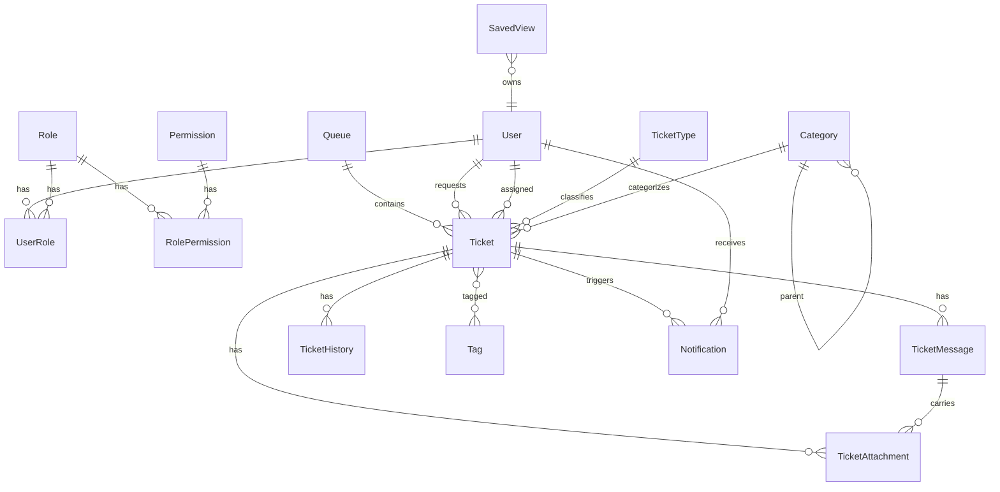
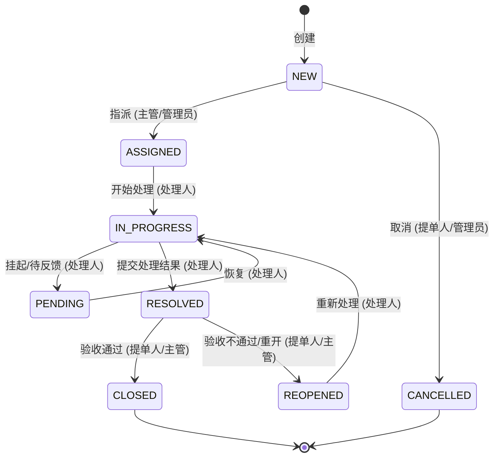

# 工单管理系统 · 设计文档

> 配套文档：[技术选型](../工单系统技术选型.md)、[开发计划](./02-开发计划.md)、[技术调研结论](./03-技术调研结论.md)
>
> 本版已纳入认证/对象存储/富文本的调研结论，以及 Zammad / GLPI / Jira Service Management 的参考设计。

## 1. 目标与范围

一套以 Web 端为主的工单（Ticket / 工单）管理系统，支持多角色协作、工单全生命周期流转、SLA 超时提醒、通知、审计留痕。前后端分离，未来可扩展桌面版（Tauri）和 App（React Native），后端 API 三端共用。

### 第一版（MVP）范围

- 认证与会话（better-auth + 服务端 Session，本地账号，预留 SSO）
- RBAC 权限（4 角色：提单人 / 处理人 / 主管 / 管理员）
- 工单核心：创建、列表（筛选/分页/排序/保存视图）、详情、编辑
- 工单状态机流转（按钮化操作 + 服务端规则校验 + 指派）
- **队列（Queue）**：工单先归队列再派个人
- **消息时间线**：工单容器与逐条消息分离，支持 public / internal 可见性
- **富文本正文（Tiptap，支持 Markdown 快捷输入）** + 附件上传
- 操作历史审计
- 通知（站内信）+ SLA 超时提醒 + SLA 倒计时可视化
- 分类（Category）+ 标签（Tags）
- 简单仪表盘（各状态工单统计）

### 暂不做（后续迭代）

- 邮件/企业微信/钉钉外部通知与多渠道接入
- 可视化工作流/自动化规则编辑器（第一版用代码内置状态机 + 硬编码规则）
- 抄送人（Observer）、工单合并/关联、宏（Macros）、知识库、自助门户、工时（worklog）
- 自定义字段（预留 JSONB 列）
- 多租户 / 报表导出

## 2. 技术架构

```
┌────────────────────────────────────────────────────────┐
│  前端 apps/web                                          │
│  React 19 + Vite + TS + shadcn/ui + Tailwind v4        │
│  TanStack Query/Table + Zustand + React Router          │
│  Tiptap(富文本) + DOMPurify(渲染消毒)                   │
└───────────────────────────┬────────────────────────────┘
                    Cookie(httpOnly) 会话
┌───────────────────────────┴────────────────────────────┐
│  后端 apps/api  (NestJS + TypeScript)                   │
│  better-auth(会话/RBAC) · CASL(能力) · sanitize-html    │
│  ┌────────┬────────┬────────┬─────────┬──────────────┐ │
│  │ auth   │ users  │ tickets│ workflow│ notifications│ │
│  │ queues │messages│attach. │  sla    │  storage     │ │
│  └────────┴────────┴────────┴─────────┴──────────────┘ │
│  Prisma(ORM)   BullMQ(异步/SLA)   StorageService(抽象) │
└──────┬──────────────────────┬───────────────┬──────────┘
      │                      │               │
┌─────┴─────┐        ┌───────┴──────┐  ┌─────┴──────┐
│PostgreSQL │        │  Redis        │  │  RustFS    │
│(主数据)   │        │(Session/队列) │  │ (S3/附件)  │
└───────────┘        └──────────────┘  └────────────┘
                                        ▲ StorageService 抽象：
                                          local FS ⇄ S3(RustFS/Garage) 可切换
```

### 认证与会话（决策：better-auth + 服务端 Session）

- 用 **better-auth** 承接认证：本地账号（邮箱/用户名 + 密码），会话数据存 **Redis**，通过 **httpOnly + Secure + SameSite cookie** 下发，前端不接触任何 token。
- **为什么不用 JWT 做会话**：JWT 无法即时撤销，退出/踢人/离职失效困难；服务端 Session 删 Redis 即时生效。JWT 只在未来「服务间调用 / 对外开放 API」时作为短时 access token 使用。
- **预留 SSO**：架构上把「身份来源」与「会话」解耦，未来对接企业 SSO/LDAP/企业微信/钉钉时，用 OIDC 登录后同样落地成 Session，无需重构。
- better-auth 开箱提供会话管理、RBAC、2FA、Passkey，后续按需开启。

### 后端分层约定

```
Controller  (接收请求、校验 DTO、鉴权 Guard)
   ↓
Service     (业务逻辑：状态流转规则、SLA 计算、审计写入、正文消毒)
   ↓
Prisma      (数据访问)          StorageService (附件读写，S3/本地可切换)
```

- **状态流转**统一走 `WorkflowService.transition()`，规则集中，禁止散写 if-else。
- 每次工单变更（状态、指派、字段）由 Service 层统一写入 `ticket_history`（审计）。
- 权限用 **CASL** 定义能力，Controller 用 `PoliciesGuard` 拦截；列表查询按角色/队列注入数据级过滤。
- **富文本正文入库前用 `sanitize-html` 白名单消毒**，前端渲染再经 DOMPurify（双端防 XSS）。
- **附件走 `StorageService` 抽象接口**（`put/get/presign/delete`），实现类可选 `LocalFsStorage` / `S3Storage(RustFS)`，配置切换。

### 对象存储（决策：RustFS 尝鲜 + 抽象层兜底）

- 生产/开发用 **RustFS**（S3 兼容，Rust，Apache-2.0），docker compose 内单节点部署。
- **风险控制**：RustFS 尚未 GA（当前 beta），故 ① 单节点；② 附件独立定期备份（可重建）；③ 跟进版本升级；④ 全部读写走 `StorageService` 抽象，若 RustFS 出问题可无痛切到本地 FS 或 Garage。详见[技术调研结论](./03-技术调研结论.md)。

## 3. 数据模型（ER）



### 核心表说明

| 表 | 关键字段 | 说明 |
|----|----------|------|
| `users` | id, username, email, password_hash, display_name, phone, avatar, status | 用户（better-auth 管理凭据） |
| `roles` | id, name, description | 角色：requester / handler / supervisor / admin |
| `permissions` | id, code, name | 权限点，如 `ticket:create`、`ticket:assign` |
| `user_roles` / `role_permissions` | 关联表 | RBAC 多对多 |
| `queues` | id, name, description, default_assignee_id | **队列/团队**：工单先归队列，派单/SLA/权限挂队列 |
| `ticket_types` | id, name, sla_response_min, sla_resolve_min | 工单类型 + 该类型 SLA 时限 |
| `categories` | id, name, parent_id | **分类树**（多级），驱动统计/派单/SLA 匹配 |
| `tags` | id, name, color | 标签 |
| `ticket_tags` | ticket_id, tag_id | 工单-标签 多对多 |
| `tickets` | id, ticket_no, title, **requester_id**, **assignee_id**, queue_id, type_id, category_id, priority, status, sla_due_at, first_response_at, created_at, updated_at, closed_at | **工单主表（容器，不含正文）** |
| `ticket_messages` | id, ticket_id, author_id, **type**(note/reply/system), **is_internal**, **content_type**(text/html), **body**, created_at | **逐条消息/往来（正文在这里）** |
| `ticket_attachments` | id, ticket_id, message_id, file_name, object_key, file_size, mime, uploader_id | 附件（object_key 指向 StorageService） |
| `ticket_history` | id, ticket_id, user_id, action, field, old_value, new_value, created_at | **审计**：每次变更留痕 |
| `notifications` | id, user_id, ticket_id, type, title, content, is_read, created_at | 站内通知 |
| `saved_views` | id, user_id, name, filter_json, is_shared | **保存筛选视图**（我的待办/未分派/已升级…） |

### 关键设计要点（来自参考系统调研）

1. **工单容器 ↔ 逐条消息分离**：`tickets` 是元数据容器，正文/回复全部进 `ticket_messages`。这是 Zammad(Article)/GLPI(Followup)/JSM(comment) 的共识，别把 body 塞进主表。
2. **requester ≠ assignee**：工单显式区分「提单人」和「处理人」两个人。
3. **消息可见性 `is_internal`**：内部备注对提单人不可见，UI 用底色区分——工单系统的分水岭功能。
4. **`content_type` 列**：第一版存 `text/html`（Tiptap 输出），但保留列以便未来兼容 markdown/plain，不锁死格式。
5. **队列（Queue）层**：先归队列再派个人，是派单与权限的挂载点。
6. **自定义字段**：第一版不做，预留 `tickets.extra JSONB` 列兜底未来需求。

### 关键字段枚举

- `tickets.priority`：`LOW` / `MEDIUM` / `HIGH` / `URGENT`
- `tickets.status`：见状态机
- `ticket_messages.type`：`REPLY`（公开回复）/ `NOTE`（内部备注）/ `SYSTEM`（系统事件）
- `ticket_history.action`：`CREATE` / `ASSIGN` / `TRANSITION` / `MESSAGE` / `UPDATE` / `ATTACH`

> `ticket_no`（如 `WO-20260709-0001`）由后端生成供人读；主键用 UUID/自增。

## 4. 工单状态机



### 流转规则表（在 `WorkflowService` 内置）

| 动作 action | from | to | 允许角色 |
|------------|------|-----|---------|
| assign | NEW / REOPENED | ASSIGNED | supervisor, admin |
| start | ASSIGNED | IN_PROGRESS | handler(被指派人), admin |
| hold | IN_PROGRESS | PENDING | handler, admin |
| resume | PENDING | IN_PROGRESS | handler, admin |
| resolve | IN_PROGRESS | RESOLVED | handler, admin |
| close | RESOLVED | CLOSED | requester, supervisor, admin |
| reopen | RESOLVED / CLOSED | REOPENED | requester, supervisor, admin |
| cancel | NEW / ASSIGNED | CANCELLED | requester, admin |

- **按钮化交互**（借鉴 JSM）：前端把「当前状态 + 当前角色」下的合法动作渲染成按钮（如「开始处理」「提交结果」），而非下拉选状态——降低误操作。
- 后端 `WorkflowService` 是唯一真相源：非法流转一律拒绝（409）。
- 每次流转写 `ticket_history`，触发通知，并重算 `sla_due_at`（进入 IN_PROGRESS 时启动 resolve 计时；首次公开回复记 `first_response_at`）。

## 5. 权限模型（RBAC）

| 角色 | 权限概要 |
|------|---------|
| **requester 提单人** | 创建工单、查看/回复自己的工单、验收、重开、取消 |
| **handler 处理人** | 查看指派给自己/本队列的工单、处理流转、回复、内部备注、上传附件 |
| **supervisor 主管** | 查看本队列全部工单、指派、流转、查看统计 |
| **admin 管理员** | 全部权限 + 用户/角色/队列/类型/分类管理 |

- 用 **CASL** 定义 `ability`，Controller 加 `@CheckPolicies()` Guard。
- **数据级隔离**：列表查询按角色注入过滤——提单人只看 `requester_id=自己`；处理人看指派或本队列；主管看本队列；admin 全看。

## 6. API 设计（REST 概览）

| 模块 | 方法 & 路径 | 说明 |
|------|-------------|------|
| Auth | better-auth 挂载 `/api/auth/*`（登录/登出/会话），GET `/auth/me` | Session cookie |
| Users | GET/POST `/users`，GET/PATCH/DELETE `/users/:id` | admin |
| Roles | GET `/roles`，GET `/permissions` | admin |
| Queues | GET/POST/PATCH `/queues` | admin/supervisor |
| Categories | GET `/categories`（树），POST/PATCH `/categories` | admin |
| Tags | GET/POST `/tags` | |
| Tickets | GET `/tickets`（筛选:status,priority,queue,assignee,category,tag,keyword,分页,排序） | 列表 |
| | POST `/tickets`（含首条消息） | 创建 |
| | GET `/tickets/:id` | 详情（含消息时间线） |
| | PATCH `/tickets/:id` | 编辑基本字段 |
| | POST `/tickets/:id/assign` | 指派（队列/个人） |
| | POST `/tickets/:id/transition` | **状态流转**（body: action） |
| | GET `/tickets/:id/history` | 审计历史 |
| Messages | GET/POST `/tickets/:id/messages` | 回复/内部备注（body: content_type=html, is_internal） |
| Attachments | POST `/attachments`（预签名或直传），GET `/attachments/:id/url` | 走 StorageService |
| Notifications | GET `/notifications`，PATCH `/notifications/:id/read`，POST `/notifications/read-all` | 站内信 |
| SavedViews | GET/POST/DELETE `/saved-views` | 保存筛选视图 |
| Stats | GET `/stats/overview` | 仪表盘统计 |

- 统一响应包裹：`{ code, data, message }`；分页：`{ items, total, page, pageSize }`。
- 统一异常过滤器 + 请求日志中间件。

## 7. 富文本 / Markdown（决策：Tiptap 存 HTML）

- 前端用 **Tiptap**（基于 ProseMirror，React 一等支持）作为工单正文/回复编辑器，开启 **Markdown 快捷输入规则**：敲 `**bold**`、`# 标题`、`- 列表`、`` `code` `` 实时转富文本（Notion 式体验），非技术用户也能用工具栏。
- 支持内联图片、附件拖拽、代码块、表格；提交时 `editor.getHTML()` 存 `ticket_messages.body`，`content_type='text/html'`。
- **安全（双端消毒防 XSS，强制）**：
  - 服务端（NestJS）：入库前用 **`sanitize-html`** 白名单标签/属性（p/a/strong/em/ul/ol/li/code/pre/img/table…，img 仅允许受信来源）。
  - 客户端：渲染前用 **DOMPurify** 再消毒。
  - 原则：永不信任用户 HTML；接收即消毒，注入 DOM 前再消毒。
- **内联图片/附件走独立上传接口 + 引用 URL**，不得 base64 塞进正文。
- 内部备注与公开回复共用同一编辑器，仅 `is_internal` 标志区分。

## 8. 异步任务 / SLA（BullMQ + Redis）

- **SLA 超时提醒**：工单进入 `IN_PROGRESS` 时按类型 `sla_resolve_min` 计算 `sla_due_at`，向 BullMQ 投递延时 job；到期若仍未 RESOLVED，生成「超时」通知并可升级优先级。
- **通知分发**：状态流转 / 指派 / 新消息时投递通知 job，写 `notifications`（后续可扩展邮件/webhook）。
- 状态变化时取消/重排原有 SLA job。
- **前端 SLA 倒计时徽章**（借鉴 JSM）：列表/详情展示剩余时间，临近/超时红色高亮。

## 9. 前端结构约定

```
apps/web/src/
  ├─ api/          # 封装后端接口 (TanStack Query hooks)  ← 逻辑层
  ├─ features/     # 按业务域组织：tickets / auth / users / queues / dashboard
  │    └─ tickets/
  │         ├─ hooks/      # useTickets, useTransition, useMessages ... (逻辑，可复用到 App)
  │         ├─ components/ # 列表表格、三栏详情、消息时间线、Tiptap 编辑器 (界面)
  │         └─ pages/
  ├─ components/   # 通用 UI (shadcn/ui 生成的组件)
  ├─ stores/       # Zustand 全局状态 (当前用户、通知未读数)
  ├─ lib/          # axios 实例、工具函数、常量(状态枚举/颜色)、DOMPurify 封装
  └─ router.tsx
```

### 工单详情页布局（借鉴 Zammad / JSM，三栏）

```
┌──────────┬───────────────────────────┬──────────────┐
│ 左：导航  │ 中：消息时间线              │ 右：元数据    │
│ 保存视图  │  · 逐条 message(公开/内部)  │  状态/优先级  │
│ 队列切换  │    内部备注黄色底高亮        │  requester    │
│ 新建工单  │  · 底部 Tiptap 回复编辑器   │  assignee     │
│          │    [回复] [内部备注] 切换    │  队列/分类     │
│          │                            │  标签         │
│          │  顶部：状态流转按钮组        │  SLA 倒计时   │
└──────────┴───────────────────────────┴──────────────┘
```

> **关键约定**：数据请求/权限判断/状态流转逻辑放 `api/` 和 `hooks/`，界面组件只管渲染。以后做 React Native App，逻辑层可直接复用，只重写 `components/`。

## 10. 目录总览（Monorepo）

```
assay/
├─ apps/
│  ├─ api/                 # NestJS 后端
│  │  ├─ prisma/schema.prisma
│  │  ├─ src/
│  │  │   └─ storage/      # StorageService 抽象 + LocalFs/S3 实现
│  │  └─ Dockerfile
│  └─ web/                 # React 前端
│     ├─ src/
│     └─ Dockerfile
├─ docker-compose.yml      # 一键拉起 pg + redis + rustfs + api + web
├─ .env.example
├─ pnpm-workspace.yaml
├─ docs/
└─ package.json
```

## 11. 开发环境（docker compose 一键拉起）

`docker compose up -d` 启动以下服务，全部热更新、源码挂载卷：

| 服务 | 镜像 | 端口 | 说明 |
|------|------|------|------|
| postgres | postgres:16 | 5432 | 主数据库，数据卷持久化 |
| redis | redis:7 | 6379 | 会话(better-auth) + BullMQ 队列 |
| rustfs | rustfs/rustfs | 9000(+控制台) | 附件对象存储（S3 兼容，单节点） |
| api | 本地构建(dev) | 3000 | NestJS，`start:dev` 热更新，挂载 `apps/api` |
| web | 本地构建(dev) | 5173 | Vite dev server，挂载 `apps/web` |
| adminer | adminer | 8080 | 可选，数据库可视化 |

- 首次：`docker compose up -d` → `pnpm --filter api prisma migrate dev` → seed（4 角色、admin 账号、默认队列、示例类型/分类）。
- **StorageService 默认指向 RustFS**；`.env` 里可切 `STORAGE_DRIVER=local` 回退到本地 FS（附件挂载卷）。
- 环境变量集中在根 `.env`（`.env.example` 提供模板）。

## 12. 关键设计原则（防坑清单）

1. 状态流转只走 `WorkflowService`，规则集中，前端按钮化、后端强校验。
2. 所有工单变更强制写审计 `ticket_history`。
3. 权限在**服务端**校验（前端隐藏按钮只是体验）；列表按角色/队列数据级隔离。
4. 附件走 `StorageService` 抽象，数据库只存 `object_key`；RustFS 未 GA，保留切换能力 + 独立备份。
5. 会话用服务端 Session（Redis），不用 JWT 做会话；身份来源与会话解耦，预留 SSO。
6. 富文本正文双端消毒（sanitize-html + DOMPurify），内联图片走独立上传。
7. 工单容器与消息分离；requester 与 assignee 分离；消息区分 public/internal。
8. 前端逻辑层与界面层分离，为三端复用铺路。
9. 时间统一 UTC 存储，前端本地化展示。
